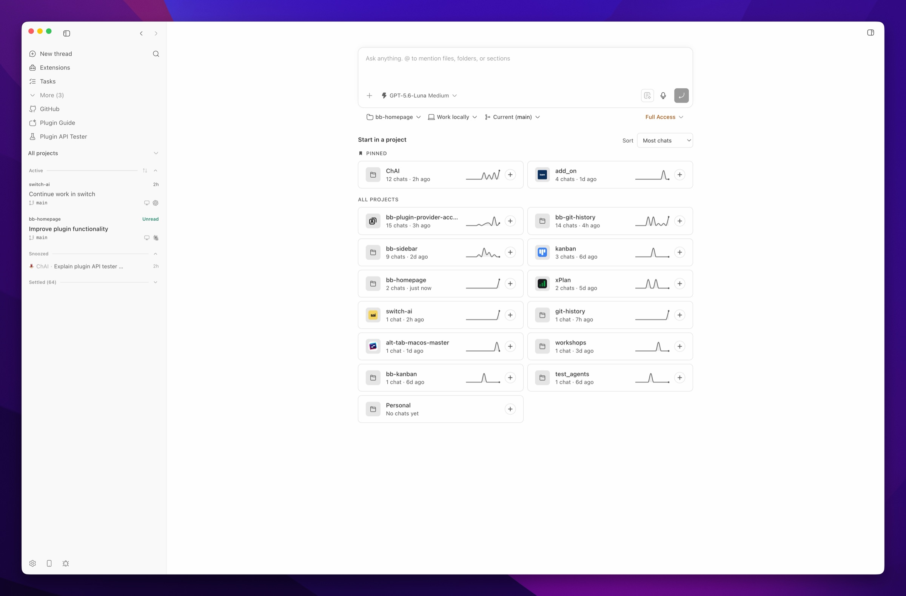

# BB Homepage

BB Homepage adds a "Start in a project" section to BB's new-thread page. Each
project card opens a focused new-thread composer for that project. The plugin
is intentionally separate from provider plugins.

<picture>
  <source media="(prefers-color-scheme: dark)" srcset="docs/screenshot-dark.jpeg">
  
</picture>

## Features

- Sort projects by recent activity, chat count, name, or a saved manual order.
  In Manual mode, drag a card to reorder it and click normally to open it.
- Highlight the project selected in the new-thread composer without moving it
  away from the chosen sort position.
- Control chat counts, projects without chats, Personal, and project artwork
  from plugin settings. All projects are visible by default.
- See each project's chat count, relative last-activity time, and 14-day
  new-chat sparkline. Archived and child chats do not affect these values.
- Pin projects from the right-click menu, or drag them into the Pinned section
  in Manual mode. Pinned projects sync across windows.
- Rename or hide a project from its right-click menu. Restore all hidden
  projects from plugin settings.
- Respect reduced-motion preferences when drawing sparklines.
- Hide BB's built-in recent-chats section on the compose page so the launcher
  stays focused on starting new chats, and fill the compact phone and
  narrow-window layout with the launcher instead of leaving that space empty.
- Load project artwork from declared BB branding or likely icon, favicon, and
  logo files. A named BB icon such as `GridView` is drawn as a theme-aware
  glyph. Personal projects and projects without usable artwork display a
  folder icon.
- Cache icon lookups, coalesce simultaneous requests, and briefly cache missing
  results.
- Serve only supported images up to 2 MB. The icon endpoint rejects unsafe
  paths, build directories, malformed SVGs, active elements, event handlers,
  foreign namespaces, doctypes, and external references.

## Requirements

- BB 0.40 or later
- Plugin SDK 0.4.29 or later

## Development

```sh
npm install --include=dev
npm test
npm run typecheck
npm exec -- bb plugin types --check .
npm run build
```

Install the working directory into BB with:

```sh
bb plugin install path:$PWD
```

After changing an installed local copy, run `bb plugin reload homepage`.
