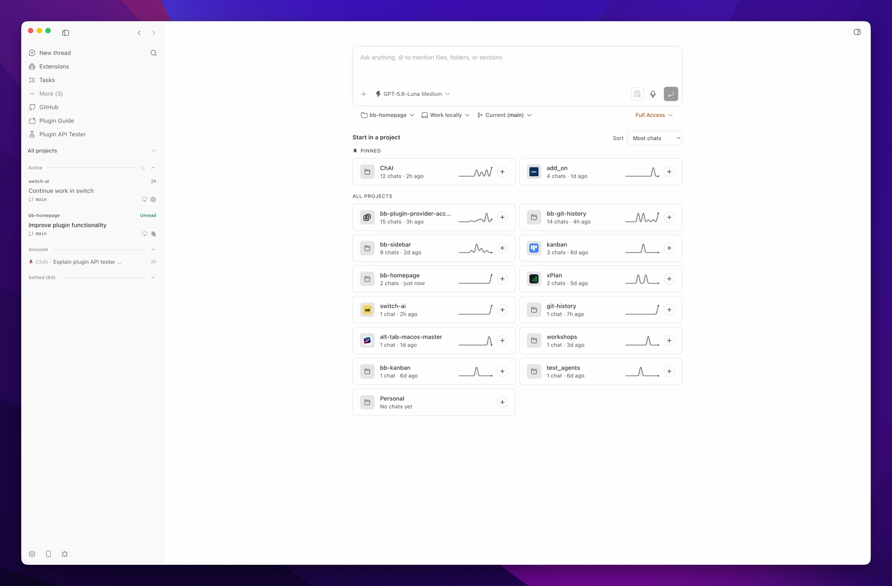

# BB Homepage

Adds a "Start in a project" section to BB's new-thread page. Click a project
card to start a new chat in that project.

<picture>
  <source media="(prefers-color-scheme: dark)" srcset="docs/screenshot-dark.jpeg">
  
</picture>

## Features

- **Project cards** show the chat count, last activity, a 14-day sparkline, and
  uncommitted changes in the project's checkout. Hover the changes to list the
  project's worktrees.
- **Status pills** mark projects with a chat that needs you, failed, or is
  running. The **Needs you** chip shows only those projects.
- **Sorting** by recent activity, chat count, name, or a manual order. In
  Manual mode, drag cards or use Alt+Arrow Up/Down.
- **Pins and groups** keep projects organized. Pin a project or move it into a
  custom group from the right-click menu, or by dragging in Manual mode.
  Pins and groups sync across windows.
- **Right-click menu** also opens the project in an installed app, renames it,
  or hides it.
- **Project artwork** comes from `bb.branding.icon` in `package.json` or common
  files such as `icon.png`, `favicon.ico`, and `logo.svg`. Other projects get a
  folder icon. The icon endpoint only serves images up to 2 MB and rejects SVGs
  with scripts or external references.

The plugin also hides BB's built-in recent-chats section on the new-thread page.

## Settings

- Show or hide chat counts, projects without chats, and Personal.
- Turn project artwork on or off.
- Show checkout status and refresh it manually or every 1, 5, or 15 minutes.
- **Compact cards** drops the sparkline and checkout changes and fits 3 or 4
  cards per row on wide screens.
- Restore hidden projects.

## Requirements

- BB 0.40 or later
- Plugin SDK 0.4.87 or later

## Development

```sh
npm install --include=dev
npm test
npm run typecheck
npm exec -- bb plugin types --check .
npm run build
```

Install the working directory into BB with:

```sh
bb plugin install path:$PWD
```

After changing an installed local copy, run `bb plugin reload homepage`.
